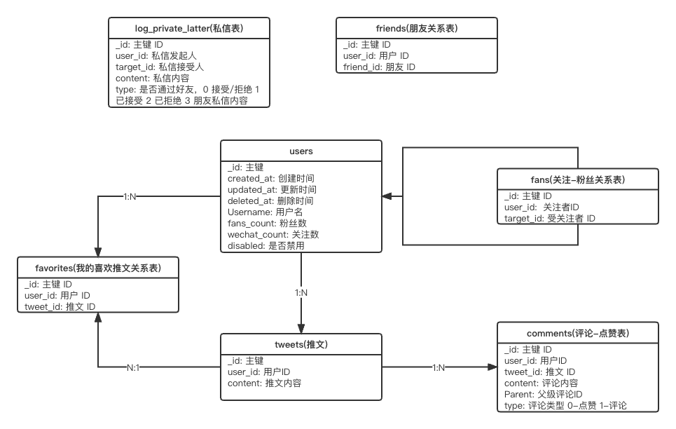

# Twitta

## Twitta介绍
一个仿`Twitter`后端项目

## Twitta项目功能点
- [x] 单点登陆
- [x] 用户相关
- [x] 推文相关
- [x] 全局搜索
- [x] 交友私信
- [x] 关注粉丝
- [x] 朋友聊天
- [x] 点赞评论
- [x] 收藏推文

## model


## 项目部署
```shell
bash ./start.sh
```

## 生成Swagger
```shell
bash ./swagger.sh
```
